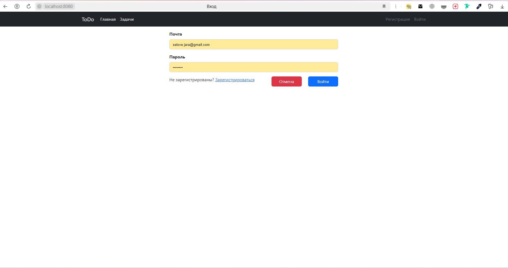
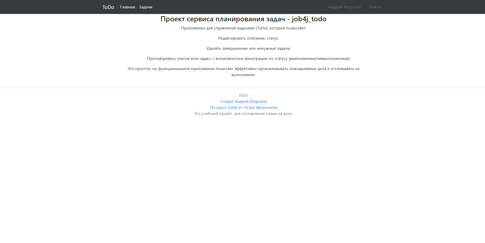
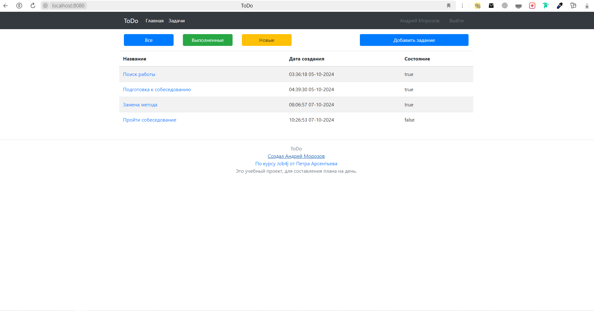
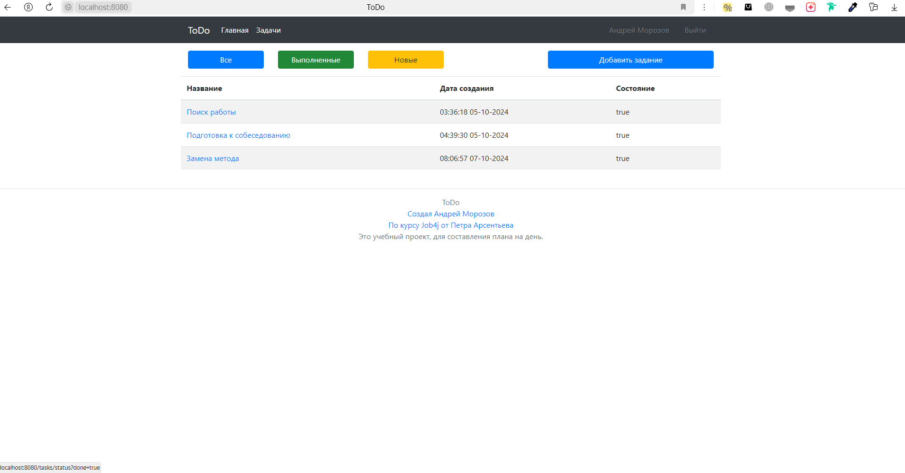
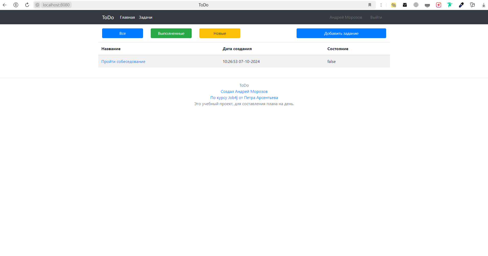
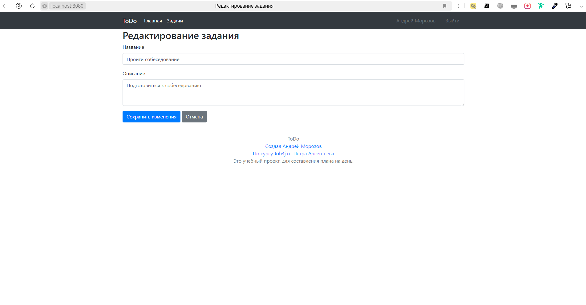

#  job4j_todo

## Описание проекта
Проект **job4j_todo** —  это приложение для управления задачами, позволяющее пользователям создавать,
просматривать и управлять своими заданиями. Пользователи могут фильтровать задания по статусу (все, выполненные или новые),
а также выполнять, редактировать или удалять задания на странице с подробной информацией.


## Стек технологий
- **Java 17** 
- **Spring Boot 2.7.6** 
- **Thymeleaf** 
- **Bootstrap** 
- **PostgreSQL 42.5.1** 
- **Liquibase 4.15.0** 
- **Maven 3.8** 
- **Hibernate 5.6.11**


## Требования к окружению
Для запуска проекта необходимо установить следующее ПО:
- **Java 17**
- **Maven 3.8**
- **PostgreSQL 42.5.1**

## Запуск проекта
1. Склонируйте репозиторий:
2. Создайте базу данных PostgreSQL :
3. Настройте доступ к базе данных в файле `hibernate.cfg.xml:
4. Запустите проект, выполнив команду:
 ```
   mvn spring-boot:run
   ```

## Контакты
- Email: selove.jara@gmail.com
- Telegram: https://t.me/Moroz_koo

## Фото проекта

<div style="display: flex; flex-wrap: wrap; gap: 20px;">
    <div>
        
        <p>Страница входа, где пользователи могут ввести свои учетные данные для доступа к приложению.</p>
    </div>
    <div>
        
        <p>Главная страница приложения, где отображается список задач.</p>
    </div>
    <div>
        
        <p>Страница добавления новой задачи, позволяющая пользователю ввести необходимые детали.</p>
    </div>
    <div>
        
        <p>Страница, где отображаются все задачи пользователя.</p>
    </div>
    <div>
        
        <p>Список завершенных задач, доступный для просмотра и анализа.</p>
    </div>
    <div>
        
        <p>Список новых задач, ожидающих выполнения.</p>
    </div>
    <div>
        
        <p>Страница с подробным описанием выбранной задачи, включая все ее атрибуты.</p>
    </div>
    <div>
        
        <p>Страница редактирования задачи, где пользователь может обновить детали задачи.</p>
    </div>
</div>
